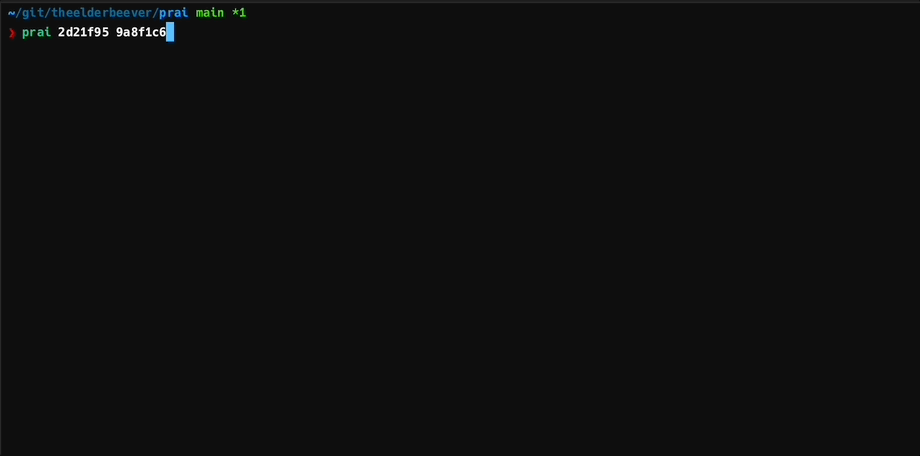

# prai - AI-Powered PR Description Generator

A command-line tool that generates concise pull request descriptions from git diffs using configurable AI providers.



## Overview

`prai` analyzes the differences between two git commits and automatically generates a professional PR description highlighting:
- What changes were made
- Why these changes matter
- Any breaking changes or important notes

Perfect for streamlining your PR workflow and ensuring consistent, informative descriptions.

## Installation

### Via Cargo

```bash
cargo install --git https://github.com/theelderbeever/prai-cli.git
```

### From Source

```bash
git clone https://github.com/theelderbeever/prai-cli.git
cd prai-cli/prai
cargo install --path .
```

## Configuration

`prai` supports multiple AI providers through a configuration file. The tool looks for a config file at:

1. `~/.config/prai/config.toml` (default location)
2. Path specified by `PRAI_HOME` environment variable + `/config.toml`
3. `./config.toml` (current directory)

### Supported Providers

- **Anthropic Claude** - Requires API key from [Anthropic's Console](https://console.anthropic.com/)
- **OpenAI GPT** - Requires API key from [OpenAI](https://platform.openai.com/)
- **Google Gemini** - Requires API key from [Google AI Studio](https://makersuite.google.com/)
- **Ollama** - For local models (requires Ollama running locally)

### Sample Configuration

Create `~/.config/prai/config.toml` with your preferred providers:

```toml
default = "claude"

[[profile]]
name = "claude"
provider = "anthropic"
version = "2023-06-01"
model = "claude-3-sonnet-20240229"
api_key = "your-anthropic-api-key"
max_tokens = 500
temperature = 0.3

[[profile]]
name = "gpt4"
provider = "openai"
model = "gpt-4"
api_key = "your-openai-api-key"
base_url = "https://api.openai.com/v1"
max_tokens = 500
temperature = 0.3

[[profile]]
name = "ollama"
provider = "ollama"
url = "http://localhost:11434"
model = "codegemma:7b"

[[profile]]
name = "gemini"
provider = "google"
model = "gemini-pro"
api_key = "your-google-api-key"
base_url = "https://generativelanguage.googleapis.com/v1beta"
max_tokens = 500
temperature = 0.3
```

## Usage

This works great with `git-fzf.sh` so I would recommend using that. Otherwise this ultimately is just calling `git diff` under the hood so whatever works for the commit arguments there should work here too.

```bash
prai <base-commit> <head-commit> [OPTIONS]
```

### Options

- `--exclude, -e`: Files to exclude from diff (default: `:!*.lock`)
- `--profile, -p`: Provider profile to use (defaults to config default)
- `--config, -f`: Path to config file (defaults to `~/.config/prai/config.toml`)

### Examples

Generate a PR description comparing two commits:
```bash
prai main feature-branch
```

Compare specific commit hashes:
```bash
prai abc123 def456
```

Exclude additional files:
```bash
prai main HEAD --exclude ":!*.lock :!dist/"
```

Use a specific profile:
```bash
prai main HEAD --profile gpt4
```

Use a custom config file:
```bash
prai main HEAD --config /path/to/custom/config.toml
```

## Sample Output

```
## Changes Made
• Implemented user authentication with JWT tokens
• Added password validation and hashing utilities
• Created login/logout API endpoints

## Impact
• Enables secure user sessions across the application
• Provides foundation for role-based access control

## Notes
• Breaking change: `/api/login` now requires email instead of username
• New dependency: `jsonwebtoken` crate added
```

## Requirements

- Git (for generating diffs)
- Rust 1.70+ (for installation)
- API key for your chosen provider (Anthropic, OpenAI, Google) or Ollama running locally

## TODO

- [ ] Configurable prompt templates
- [ ] Additional output formats (JSON, Markdown templates)

## License

MIT
